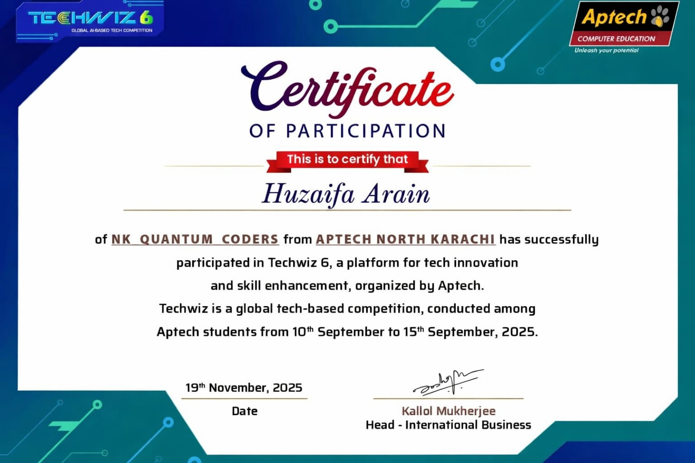

  

  <a href="https://git.io/typing-svg">
    <picture>
      <source media="(prefers-color-scheme: dark)" srcset="https://readme-typing-svg.demolab.com?font=Fira+Code&weight=700&size=25&pause=1000&color=F7D302&width=600&center=true&lines=MUHAMMAD+HUZAIFA+ARAIN;SOFTWARE+ENGINEER;TACTICAL+STRATEGIST;DEPUTY+COORDINATOR" />
      
    </picture>
  </a>

   
   
  

A mission-oriented **Software Engineer** and **Tactical Digital Strategist** operating with absolute discipline, precision, and a high-command mindset. Expert in architecting resilient digital defense structures, deploying enterprise-grade software infrastructure, and commanding complex technical operations under strict tactical frameworks. Bridging the gap between robust codebase deployment and regional strategic leadership.

---

### 🎯 CORE OPERATIONAL CAPABILITIES

  

*   ### ⚡ Strategic Infrastructure & Deployment
Architecting fortified, high-performance, and scalable full-stack ecosystems engineered to withstand heavy operational loads.
*   ### 🕹️ Command & Technical Control
Leading critical technical workflows, enforcing operational integrity, and aligning development protocols with mission objectives.
*   ### 📢 Information Operations & Strategy
Directing large-scale digital communication tactics, automated workflows, and high-impact public outreach campaigns.

---

### 🎖️ COMMAND & LEADERSHIP RECORD

  

> ### 🦅 Deputy Coordinator | Social Media Command (Karachi Zone)
> **Pakistan Awami Tehreek**
> *   **Strategic Deployment:** Commanding regional digital operations, overseeing structural workflows, and maintaining strict operational readiness across a non-technical vanguard.
> *   **Campaign Execution:** Executing data-driven digital campaigns, optimizing cross-platform communication channels, and neutralizing information bottlenecks under high-pressure scenarios.

---

### 🛠️ TACTICAL TECHNICAL ARSENAL

  

| OPERATIONAL SECTOR | WEAPONS & FRAMEWORKS |
| :--- | :--- |
| **⚔️ Backend & Structural Fortress** | `C#` • `ASP.NET Core` • `PHP` • `Laravel` |
| **🛰️ Frontend Operations & Mobile Recon** | `Dart` • `Flutter` • `UI & UX Frameworks` *(`Figma Tactical Blueprints`)* |
| **🔐 Database, Security & Intelligence** | `Enterprise Identity Management` • `Relational Databases` • `Automated Workflows` |
| **🌐 Full-Stack / MERN Strike Force** | `MongoDB` • `Express.js` • `React` • `Node.js` • `REST APIs` • `JWT / Auth` |

---

### ⚙️ FULL-STACK // MERN STACK ORDNANCE

  

  
  
  
  
  
  
  
  
  
  
  
  

  

---

### 🏅 CERTIFICATIONS & FIELD DEPLOYMENTS

  

> ### 🎖️ TECH VISION 2026 — CERTIFIED OPERATIVE
> **Path Seeker | Website UI/UX Design Campaign**
> *   **Tactical Design:** Engineered complete UI/UX blueprints for the *Path Seeker* website using **Figma** tactical drafting tools.
> *   **Documentation Unit:** Authored mission-critical documents and comprehensive **User Guides** for seamless field deployment.
> *   **Campaign Status:** ✅ **CERTIFIED** — Tech Vision 2026 Official Credential

  
   
  🎖️ <b>TECH VISION 2026</b> — Official Certificate of Achievement — Path Seeker UI/UX Design Operation

---

### 🐍 OPERATIONAL CAMPAIGN MAP

  

  <picture>
    <source media="(prefers-color-scheme: dark)" srcset="https://raw.githubusercontent.com/Huzaifa-Arain1625/Huzaifa-Arain1625/output/github-snake-dark.svg" />
    <source media="(prefers-color-scheme: light)" srcset="https://raw.githubusercontent.com/Huzaifa-Arain1625/Huzaifa-Arain1625/output/github-snake.svg" />
    
  </picture>

---

### 📡 OPERATIONAL TELEMETRY

  

  
  
  

  

  
  

---

### 🔗 CONNECT WITH ME

  

  
  
  
  

---

<h1 align="center">
  <i>"Strategy without execution is an illusion. Execution without discipline is a failure."</i>
</h1>
